# Bank Customer Churn Prediction

> Binary classification project comparing four machine learning algorithms to predict which bank customers are at risk of churning, with full EDA, preprocessing pipeline, model evaluation, and XGBoost feature importance analysis.

---

## Table of Contents

1. [Project Overview](#project-overview)
2. [Dataset](#dataset)
3. [Project Structure](#project-structure)
4. [Installation & Setup](#installation--setup)
5. [Methodology](#methodology)
6. [Exploratory Data Analysis](#exploratory-data-analysis)
7. [Machine Learning Models](#machine-learning-models)
8. [Model Evaluation](#model-evaluation)
9. [Feature Importance](#feature-importance)
10. [Limitations](#limitations)

---

## Project Overview

Customer churn is when a customer ends their relationship with a business, and is a critical problem in banking. Acquiring a new customer typically costs five to seven times more than retaining an existing one, making early identification of at-risk customers a high-value task.

This project builds and compares four classification models to predict whether a bank customer will churn (`Exited = 1`) or stay (`Exited = 0`), using demographic, financial, and behavioural features. The pipeline covers data cleaning, EDA, feature engineering, preprocessing, model training, comparative evaluation, and XGBoost feature importance extraction.

---

## Dataset

| Attribute | Detail |
|---|---|
| **Source** | [Kaggle — Bank Customer Churn Prediction](https://www.kaggle.com/datasets/shantanudhakadd/bank-customer-churn-prediction) |
| **File** | `Churn_Modelling.csv` |
| **Records** | 10,000 customers |
| **Target variable** | `Exited` (0 = retained, 1 = churned) |

### Features

Columns `RowNumber`, `CustomerId`, and `Surname` are dropped at ingestion as they carry no predictive signal.

| Feature | Type | Description |
|---|---|---|
| `CreditScore` | Numerical | Customer's credit score |
| `Geography` | Categorical | Country of residence (France, Germany, Spain) |
| `Gender` | Categorical | Customer gender |
| `Age` | Numerical | Customer age |
| `Tenure` | Numerical | Years as a customer |
| `Balance` | Numerical | Account balance |
| `NumOfProducts` | Numerical | Number of bank products held |
| `HasCrCard` | Binary | Whether the customer holds a credit card (1/0) |
| `IsActiveMember` | Binary | Whether the customer is an active member (1/0) |
| `EstimatedSalary` | Numerical | Estimated annual salary |
| `Exited` | Binary (target) | Whether the customer churned (1 = yes, 0 = no) |

### Class Distribution

The dataset is moderately imbalanced, with churned customers representing a minority of the overall sample — a key consideration for interpreting precision and recall scores.

---

## Project Structure

```
├── bank_churn.ipynb         # Main analysis and modelling notebook
├── Churn_Modelling.csv      # Raw dataset
└── README.md                # This file
```

---

## Installation & Setup

### Prerequisites

- Python 3.9+
- Jupyter Notebook or JupyterLab

### Dependencies

```bash
pip install pandas numpy matplotlib seaborn scikit-learn xgboost
```

### Running the Notebook

```bash
git clone https://github.com/brandonkongwe/ml-notebooks/tree/main/bank-churn
cd bank-churn

# Download Churn_Modelling.csv from Kaggle and place it in the project root

jupyter notebook bank_churn.ipynb
```

---

## Methodology

### 1. Data Cleaning

- Dropped identifier columns (`RowNumber`, `CustomerId`, `Surname`).
- Verified zero null values — no imputation was required.
- Confirmed datatypes and summary statistics via `data.info()` and `data.describe()`.

### 2. Preprocessing Pipeline

| Step | Detail |
|---|---|
| **Train-test split** | 70% train / 30% test, `random_state=42` |
| **Numerical scaling** | `StandardScaler` applied to `CreditScore`, `Age`, `Tenure`, `Balance`, `EstimatedSalary` via `ColumnTransformer` (fitted on train set only, then applied to test set) |
| **Categorical encoding** | `OneHotEncoder` (`handle_unknown="ignore"`, `sparse_output=False`) applied to `Geography` and `Gender` |
| **Type casting** | Residual object columns cast to `float` after encoding |

Scaling is fitted exclusively on the training set to prevent data leakage into the test set.

### 3. Model Training

All four models are trained using default hyperparameters (no tuning).

---

## Exploratory Data Analysis

The EDA investigates the relationship between each feature and churn via univariate distributions and bivariate breakdowns:

- **Class distribution**: Count plot of the `Exited` target variable to visualise class imbalance.
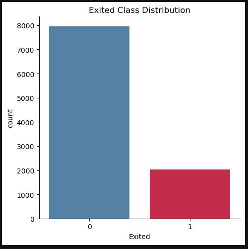
- **Credit score by gender**: Bar chart of mean credit scores split by gender and churn status.
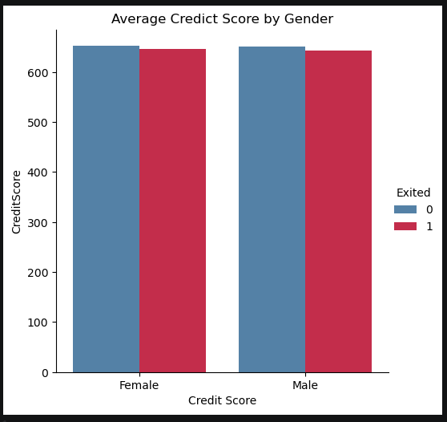
- **Estimated salary vs. churn**: Box plot — salary distributions are broadly similar across churned and retained customers, suggesting salary alone is a weak predictor.
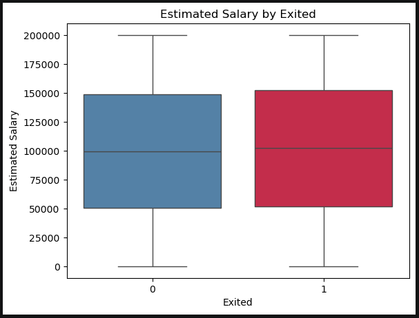
- **Balance vs. churn**: Box plot — churned customers tend to carry higher balances, indicating that high-balance customers may be more likely to leave (possibly migrating to competitors).
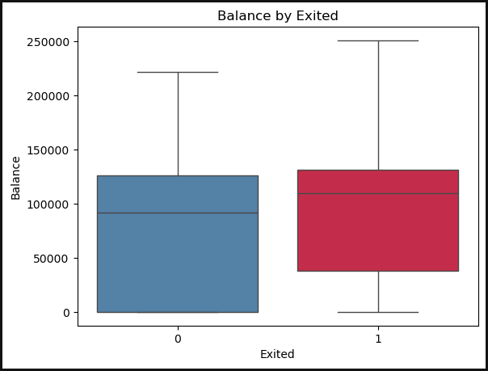
- **Number of products vs. churn**: Count plot — customers holding only one product churn at a high rate; customers holding three or more products show near-total churn, likely due to product lock-in issues.
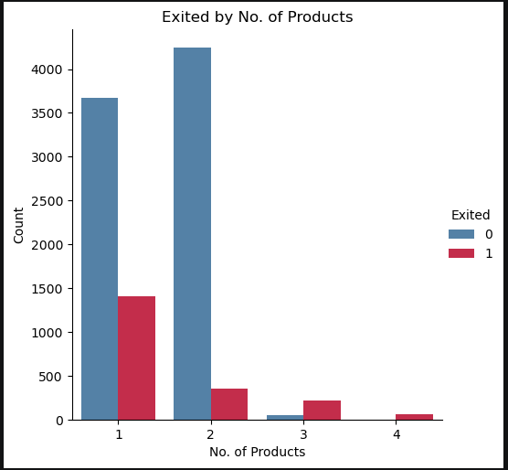
- **Geography vs. churn**: Count plot — German customers churn at a noticeably higher rate relative to their population share compared to French and Spanish customers.
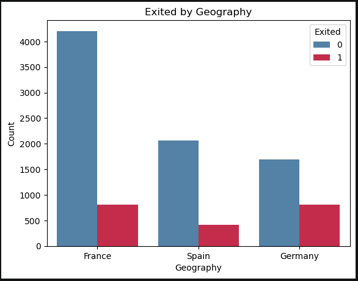
- **Credit score vs. churn**: Box plot — distributions are similar, suggesting credit score is not strongly predictive on its own.
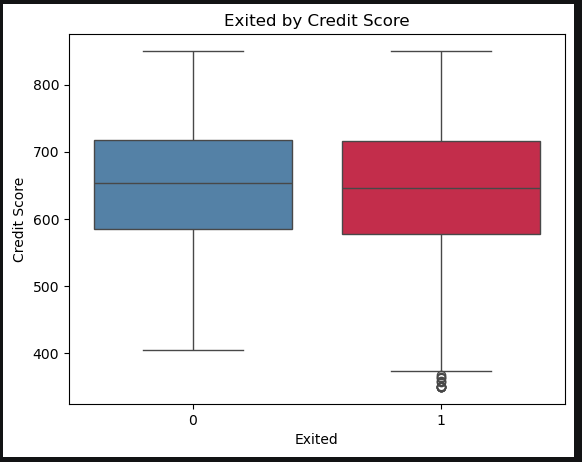
- **KDE distributions**: Overlaid density plots for all numerical features, split by churn status, to identify separability.
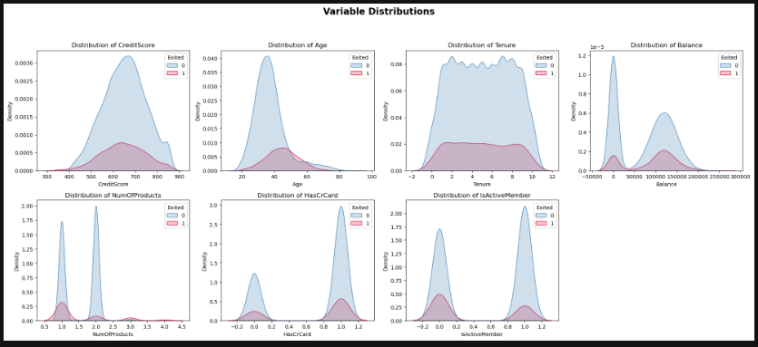
- **Spearman correlation heatmap**: Rank-based correlation matrix across numerical features to identify multicollinearity. `Age` and `Balance` show the strongest positive associations with churn among numerical features.
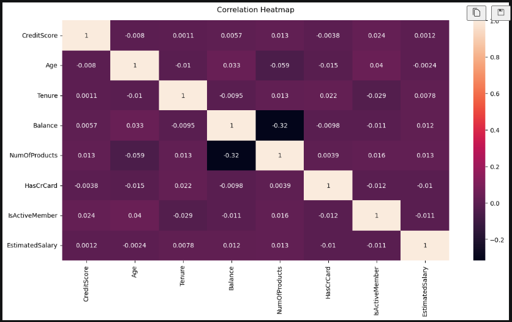
---

## Machine Learning Models

Four classifiers are trained and compared:

| Model | Type | Notes |
|---|---|---|
| **Random Forest** | Ensemble (Bagging) | Aggregates predictions from multiple decision trees; robust to overfitting and outliers |
| **Support Vector Machine (SVM)** | Kernel-based | Effective for binary classification in high-dimensional spaces; sensitive to feature scaling (hence standardisation) |
| **Histogram-based Gradient Boosting (HGB)** | Ensemble (Boosting) | scikit-learn's native fast boosting implementation; memory-efficient; handles large datasets well |
| **XGBoost** | Ensemble (Gradient Boosting) | Industry-standard gradient boosting; includes native feature importance extraction |

All models are evaluated on the same held-out test set (30% of data).

---

## Model Evaluation

### Metrics

Each model is assessed across five metrics:

| Metric | What it measures |
|---|---|
| **Accuracy** | Overall proportion of correct predictions |
| **Precision** (weighted) | Of all predicted churners, how many actually churned — penalises false positives |
| **Recall** (weighted) | Of all actual churners, how many were correctly identified — penalises false negatives |
| **F1-Score** (weighted) | Harmonic mean of precision and recall — balances both concerns |
| **AUC-ROC** | Area under the ROC curve — measures the model's ability to discriminate between classes across all thresholds |

> In a churn context, **recall** is typically the priority metric: a missed churner (false negative) is more costly than a false alarm (false positive), as the bank loses a customer rather than incurring an unnecessary retention offer.

### Visualisations

Four comparison grids are produced:

- **Precision-Recall curves**: Trade-off at each decision threshold per model.
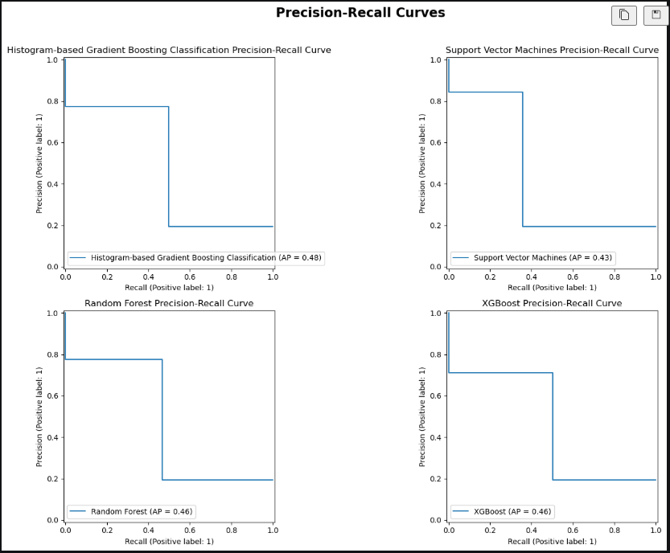
- **ROC curves**: True positive rate vs. false positive rate per model.
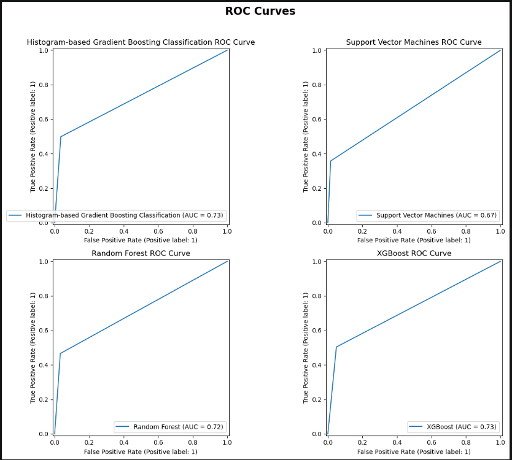
- **Normalised confusion matrices**: Row-normalised breakdowns showing the proportion of each class correctly and incorrectly classified.
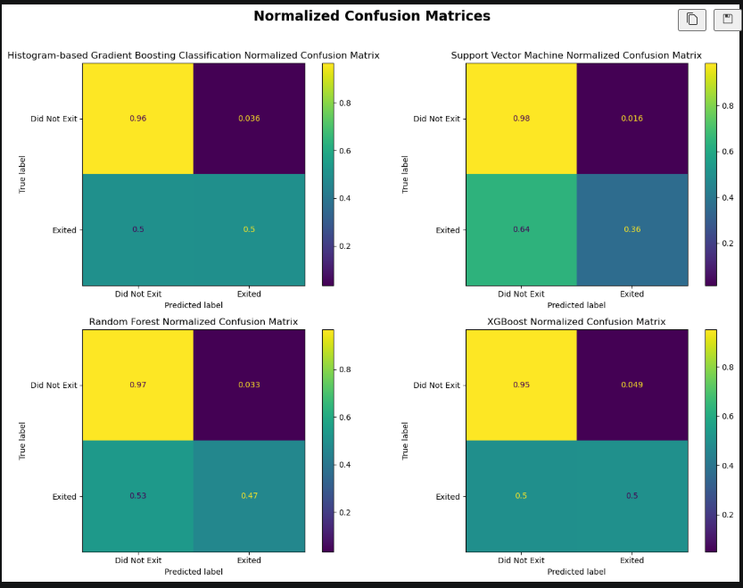
- **Model comparison table**: Side-by-side summary of all five metrics across all four models.

### Results


| Model | Accuracy | Precision | Recall | F1-Score | AUC-ROC |
|---|---|---|---|---|---|
| Random Forest | 87% |86% | 87% | 86% | 72% |
| SVM | 86% | 86% | 86% | 84% | 67% |
| Histogram Gradient Boosting | 87% | 87% | 87% | 86% | 73% |
| XGBoost | 86% | 85% | 86% | 85% | 73% |

---

## Feature Importance

Feature importance is extracted from the trained XGBoost model using its native `feature_importances_` attribute, which measures the gain contributed by each feature across all splits.

The top 10 most influential features are visualised as a horizontal bar chart. Key candidates based on the EDA are:
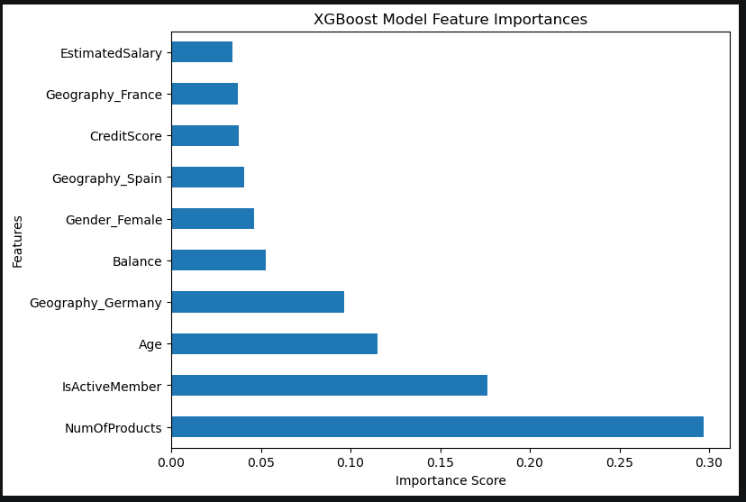
- **Age** — consistently separated churn distributions in KDE plots.
- **Balance** — churned customers showed distinctly higher balances.
- **NumOfProducts** — strong non-linear relationship with churn rate.
- **IsActiveMember** — active vs. inactive membership is a known churn signal.
- **Geography_Germany** — Germany showed disproportionately high churn.

---

## Limitations

- **Default hyperparameters**: No grid search or Bayesian optimisation was performed. Results represent baseline model performance, not best achievable.
- **Class imbalance not addressed**: The dataset is imbalanced (majority retained, minority churned). No resampling (SMOTE, undersampling) or class weighting was applied, which may suppress recall for the minority (churned) class.
- **No probability calibration**: SVM outputs hard class labels by default (`predict`, not `predict_proba`). The ROC and precision-recall curves for SVM are therefore less informative than for the probabilistic models.
- **Static snapshot**: The dataset represents a single point-in-time snapshot. No temporal features (e.g. recency of transactions, account activity trends) are included, which limits the model's ability to capture behavioural drift leading up to churn.
- **Single dataset**: The model is trained and evaluated on one institution's customer data. Generalisation to other banks or geographies is unknown.

