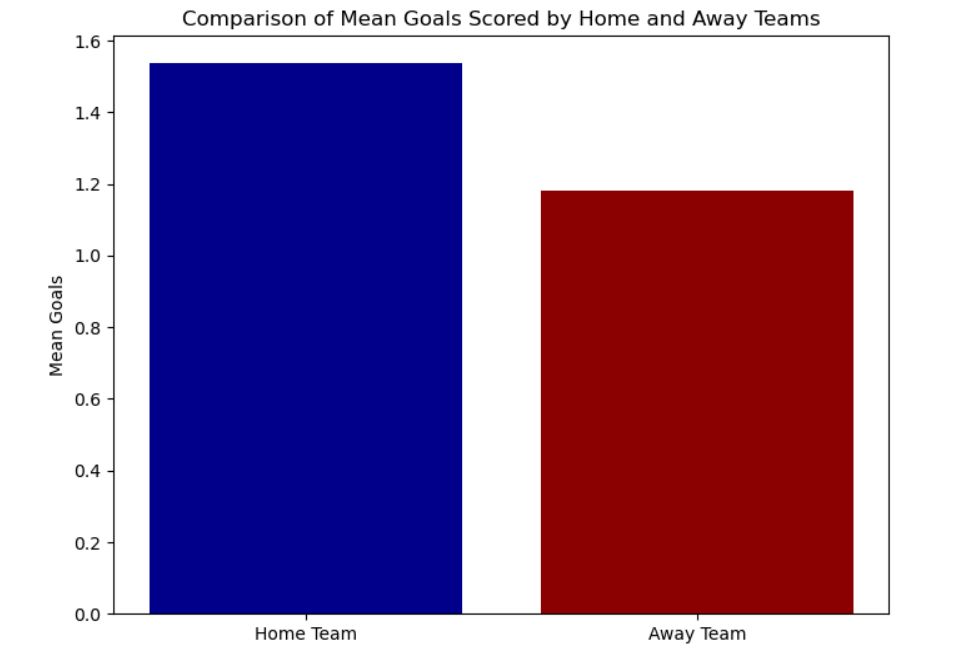
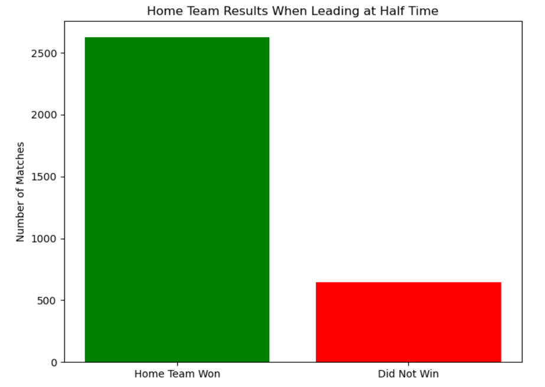
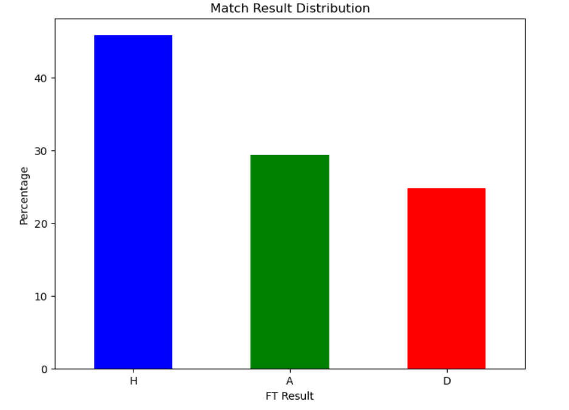
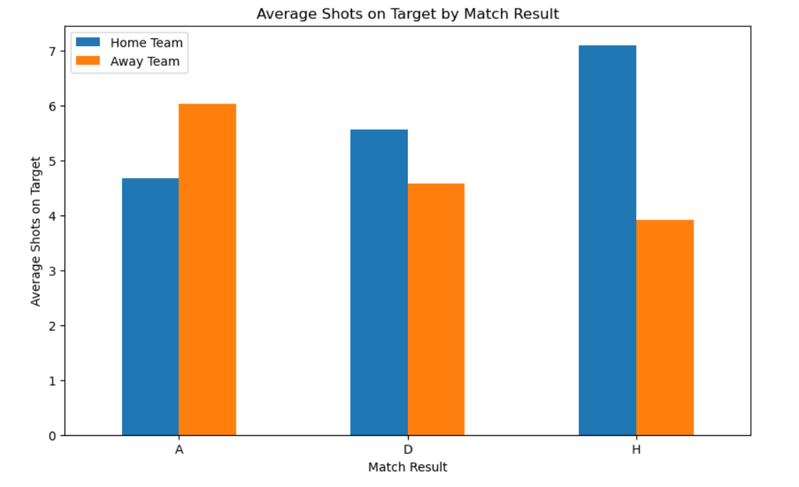
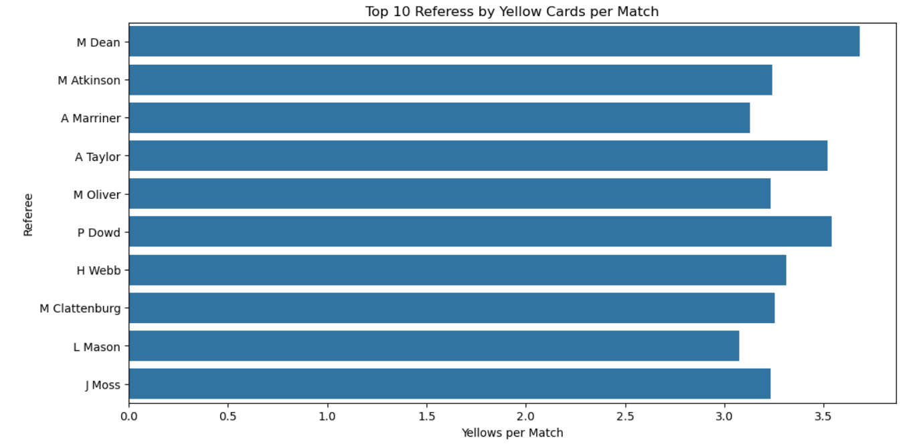
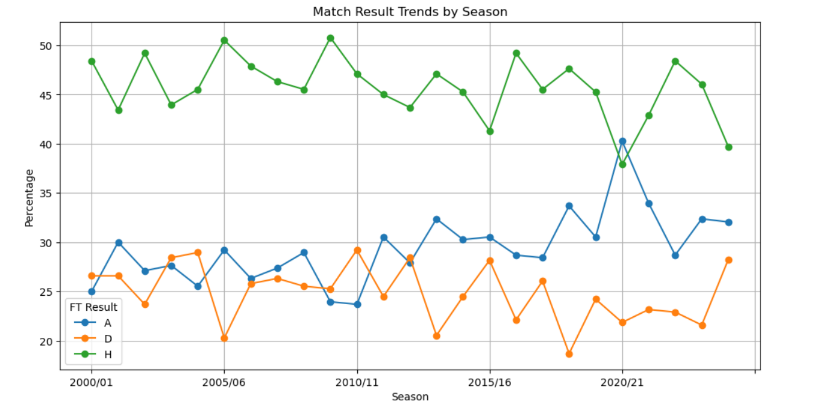
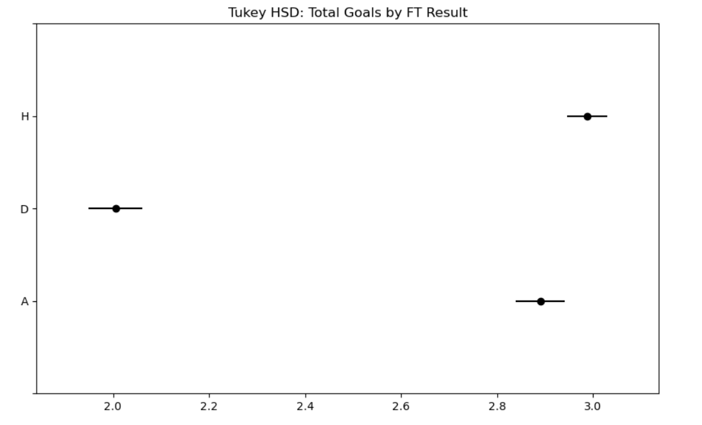
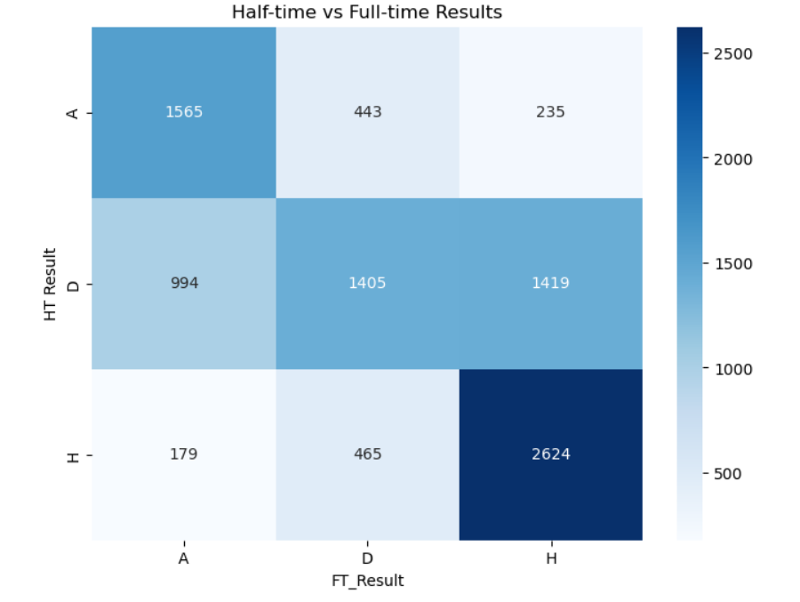

# Premier League Match Analysis (2000–2025)

> Statistical analysis and machine learning on 25 seasons of English football match data, covering home advantage, referee behaviour, goal patterns, and predictive modelling.

---

## Table of Contents

1. [Project Overview](#project-overview)
2. [Dataset](#dataset)
3. [Project Structure](#project-structure)
4. [Installation & Setup](#installation--setup)
5. [Methodology](#methodology)
6. [Analysis & Key Findings](#analysis--key-findings)
7. [Machine Learning Models](#machine-learning-models)
8. [Limitations](#limitations)
9. [Future Work](#future-work)
10. [Credits & References](#credits--references)

---

## Project Overview

This project performs an end-to-end statistical and predictive analysis of English Premier League match data spanning the 2000/01 to 2024/25 (mid-season) seasons. The analysis is structured around several research questions, each investigated using appropriate statistical tests (paired t-tests, one-way ANOVA, chi-square test of independence) and visualised with matplotlib and seaborn. Predictive models are then built using linear regression (goal scoring) and multinomial logistic regression (match outcome classification).

**Research Questions:**
- Is there a statistically significant home advantage in the Premier League?
- How often does a half-time lead convert to a full-time win for the home team?
- What is the overall distribution of match outcomes across the dataset?
- Do home teams generate more shots on target than away teams?
- How do shots on target relate to match outcome?
- Is there evidence of referee bias in yellow card allocation?
- Which referees issue the most yellow cards per match?
- How has home team performance evolved across seasons?
- Does match outcome influence total goals scored?
- Is there a statistically significant association between half-time and full-time results?

---

## Dataset

| Attribute | Detail |
|---|---|
| **Source** | [Kaggle — English Premier League and Championship Full Dataset](https://www.kaggle.com/datasets/panaaaaa/english-premier-league-and-championship-full-dataset) |
| **Original range** | 1993/94 – 2024/25 (mid-season) |
| **Filtered range** | 19-08-2000 – 16-01-2025 |
| **Reason for filtering** | Match statistics (shots, cards, corners) were not consistently recorded before the 2000/01 season |
| **Data credit** | Joseph Buchdahl — [@12Xpert](https://x.com/12Xpert) / [12xpert.co.uk](http://12xpert.co.uk/) |

### Variables (25 columns)

| # | Column | Description |
|---|---|---|
| 1 | `Date` | Match date |
| 2 | `Season` | Football season (e.g. 2023-24) |
| 3 | `HomeTeam` | Home side |
| 4 | `AwayTeam` | Away side |
| 5 | `FTH Goals` | Full-time home goals |
| 6 | `FTA Goals` | Full-time away goals |
| 7 | `FT Result` | Full-time result (H / A / D) |
| 8 | `HTH Goals` | Half-time home goals |
| 9 | `HTA Goals` | Half-time away goals |
| 10 | `HT Result` | Half-time result (H / A / D) |
| 11 | `Referee` | Match official |
| 12 | `H Shots` | Home team total shots |
| 13 | `A Shots` | Away team total shots |
| 14 | `H SOT` | Home shots on target |
| 15 | `A SOT` | Away shots on target |
| 16 | `H Fouls` | Home team fouls |
| 17 | `A Fouls` | Away team fouls |
| 18 | `H Corners` | Home team corners |
| 19 | `A Corners` | Away team corners |
| 20 | `H Yellow` | Home yellow cards |
| 21 | `A Yellow` | Away yellow cards |
| 22 | `H Red` | Home red cards |
| 23 | `A Red` | Away red cards |
| 24 | `Display_Order` | Ordering field for match display |
| 25 | `League` | Competition name |

### Engineered Features

The following columns were derived during preprocessing:

| Column | Formula |
|---|---|
| `TotalGoals` | `FTH Goals + FTA Goals` |
| `GoalDifference` | `FTH Goals − FTA Goals` |
| `HTGoalDifference` | `HTH Goals − HTA Goals` |
| `H ShotAccuracy` | `H SOT / H Shots` |
| `A ShotAccuracy` | `A SOT / A Shots` |
| `H ShotConversion` | `FTH Goals / H SOT` |
| `A ShotConversion` | `FTA Goals / A SOT` |
| `HomeYellowsPerFoul` | `H Yellow / H Fouls` |
| `AwayYellowsPerFoul` | `A Yellow / A Fouls` |
| `SOT Diff` | `H SOT − A SOT` |

---

## Project Structure

```
├── pl_data.ipynb          # Main analysis notebook
├── England CSV.csv        # Raw dataset 
└── README.md              # This file
```

---

## Installation & Setup

### Prerequisites

- Python 3.9+
- Jupyter Notebook or JupyterLab

### Dependencies

```bash
pip install pandas numpy matplotlib seaborn scipy statsmodels scikit-learn
```

### Running the Notebook

```bash
git clone https://github.com/brandonkongwe/ml-notebooks/tree/main/pl-data
cd pl-data

# Download the dataset from Kaggle and place it in the project root as:
# England CSV.csv

jupyter notebook pl_data.ipynb
```

---

## Methodology

### Data Cleaning

- Parsed `Date` column to `datetime`.
- Filtered to matches played between **19 August 2000** and **16 January 2025** to ensure complete statistical coverage.
- Replaced `inf` and `NaN` values arising from division-by-zero in derived ratio columns with `0`.

### Statistical Tests

| Test | Application |
|---|---|
| **Paired t-test** (one-tailed) | Home vs. away goals; home vs. away shots on target; yellow cards per foul |
| **Levene's Test** | Homogeneity of variance across goal total groups before ANOVA |
| **One-way ANOVA** | Whether mean total goals differs across match outcome groups (H / D / A) |
| **Tukey's HSD** | Post-hoc pairwise comparisons following a significant ANOVA result |
| **Chi-square test of independence** | Association between half-time result and full-time result |
| **Cramér's V** | Effect size for the chi-square test |
| **Cohen's d** | Effect size for all paired t-tests |

Significance level: **α = 0.05** throughout.

---

## Analysis & Key Findings

### 1. Home Advantage — Goals
A one-tailed paired t-test confirmed that home teams score significantly more goals than away teams on average. Cohen's d indicated a **small-to-medium effect size**, consistent with the well-documented home advantage in football.



### 2. Half-time Lead → Full-time Win
When the home team led at half-time, they converted that lead into a full-time win approximately **~80% of the time** — a strong predictive signal.



### 3. Overall Result Distribution
Since 2000/01, the distribution of full-time results is approximately:
- **Home win**: ~46%
- **Away win**: ~28%
- **Draw**: ~26%

Away wins have shown a slight upward trend in recent seasons, with a notable spike in 2020/21 (the COVID-19 season played without fans).



### 4. Home Advantage — Shots on Target
A one-tailed paired t-test confirmed home teams average significantly more shots on target than away teams. Mean SOT: **~5.5 (home)** vs. **~4.3 (away)**.

### 5. Shots on Target by Outcome
Average SOT by match result:
- **Home win**: Home 7.1, Away 3.9
- **Away win**: Home 5.6, Away 4.6
- **Draw**: Home 4.6, Away 4.5

SOT differential is a strong discriminating factor between home wins and other outcomes.



### 6. Referee Bias — Yellow Cards
A one-tailed paired t-test on yellow cards per foul found statistically significant evidence that **away teams receive more yellow cards per foul than home teams**, consistent with crowd influence on refereeing decisions.

### 7. Referee Rankings
The top 10 referees by yellow cards per match were identified, with a minimum match count filter applied to exclude low-sample outliers.



### 8. Seasonal Trends
Home win percentages have remained broadly stable between **40–50%** across seasons. The 2020/21 season (played in empty stadiums) stands out as an anomaly with a noticeably lower home win rate, providing natural quasi-experimental evidence for crowd effects.



### 9. Total Goals and Match Outcome (ANOVA)
Levene's test indicated unequal variances across outcome groups. Despite this, a one-way ANOVA returned a highly significant F-statistic, confirming that mean total goals differs across outcome groups. Tukey's HSD post-hoc tests showed **all three pairwise comparisons (H vs A, H vs D, A vs D) were statistically significant**, with draws producing the lowest average goals.



### 10. Half-time vs Full-time Association (Chi-square)
The chi-square test strongly rejected independence between half-time and full-time results. Cramér's V indicated a **moderate-to-strong association**, confirming that the half-time scoreline is a meaningful predictor of the final result.


---

## Machine Learning Models

### Score Prediction (Linear Regression)

**Features used:** `H Shots`, `A Shots`, `H SOT`, `A SOT`, `H Corners`, `A Corners`

| Target | RMSE (Test Set) | R² (Test Set) | CV RMSE (10-fold) |
|---|---|---|---|
| Home Goals (`FTH Goals`) | 1.1454 | 0.2134 | 1.1584 |
| Away Goals (`FTA Goals`) | 1.0014 | 0.2298 | 1.0129 |


**Key finding:** Shots on target (`H SOT`, `A SOT`) are the highest-weight features in both models, as expected.

---

### Match Outcome Classification (Multinomial Logistic Regression)

**Target encoding:** Home Win = `1`, Draw = `0`, Away Win = `−1`

**Features used:** Same six features as above.

| Metric | Value |
|---|---|
| Accuracy | See notebook output |
| ROC-AUC (OvO, macro) | See notebook output |

Full `classification_report`:
|              | precision | recall | f1-score | support |
|--------------|-----------|--------|----------|---------|
| Away Win     | 0.55      | 0.57   | 0.56     | 571     |
| Draw         | 0.47      | 0.02   | 0.04     | 455     |
| Home Win     | 0.57      | 0.86   | 0.69     | 840     |
|              |           |        |          |         |
| accuracy     |           |        | 0.57     | 1866    |
| macro avg    | 0.53      | 0.48   | 0.43     | 1866    |
| weighted avg | 0.54      | 0.57   | 0.49     | 1866    |
---

## Limitations

- **No post-match data leakage check**: shot counts are only available after a match concludes, so the predictive models are descriptive/retrospective rather than truly prospective.
- **Zero-imputation**: division-by-zero cases in ratio columns (e.g. shots = 0) are replaced with 0, which may introduce a small systematic bias in shot accuracy/conversion distributions.
- **COVID-19 season**: the 2020/21 season (played without fans) represents a structural break in the home advantage signal. It is not excluded from aggregate tests.
- **Referee bias test scope**: the yellow card test measures a population-level signal; it does not account for individual referee tendencies, match stakes, or game state (scoreline, red cards already shown).

---
## Credits & References

- **Dataset**: [Kaggle — English Premier League and Championship Full Dataset](https://www.kaggle.com/datasets/panaaaaa/english-premier-league-and-championship-full-dataset)
- **Original data compiler**: Joseph Buchdahl — [@12Xpert](https://x.com/12Xpert) / [12xpert.co.uk](http://12xpert.co.uk/)
- **Libraries**: pandas, numpy, matplotlib, seaborn, scipy, statsmodels, scikit-learn